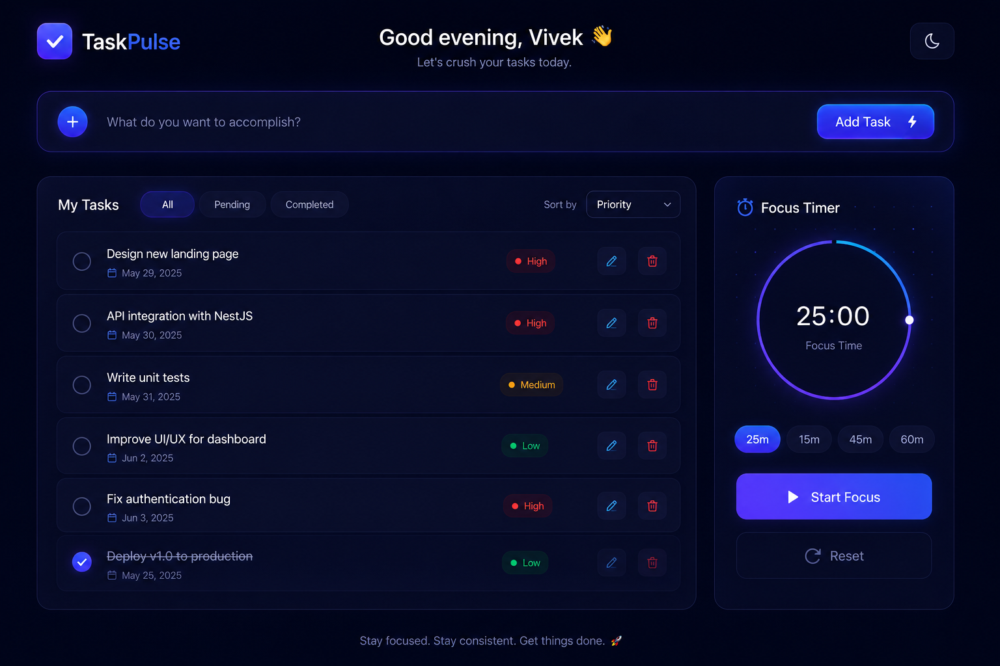
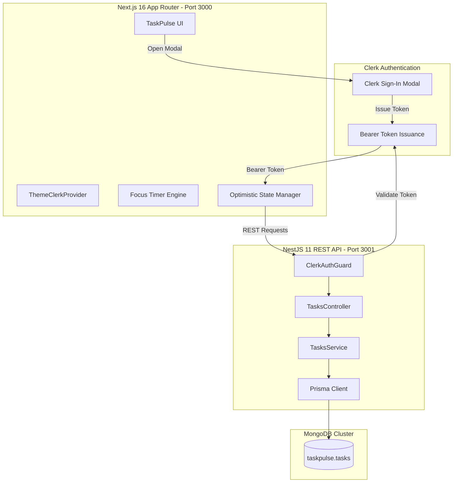

<p align="center">
  
</p>

<h1 align="center">TaskPulse</h1>

<p align="center">
  <strong>Production-Grade Task Management & Focus Suite</strong>
</p>

<p align="center">
  <bold>Engineered for speed, clarity, and deep focus — powered by Next.js 16, NestJS 11, Prisma ORM, and MongoDB.</bold>
</p>

<p align="center">
  
  
  
  
  
  
  
</p>

---

## 📸 Preview

<p align="center">
  
</p>

---

## 🌟 Key Features

### ⚡ Tactile 3D Button Design System
- **Custom-Engineered 3D Physics**: Buttons feature specular top edge highlights, depth-calculated bottom borders, ambient glow, and micro-transition press states (`active:translate-y-1`).
- **Interactive Quick-Cycle (+) Button**: One-click cycle between **High**, **Medium**, and **Low** priorities with immediate visual feedback.
- **Adaptive Inverted Tooltips**: Floating custom tooltips that adapt to the active theme (light tooltip on dark mode, dark tooltip on light mode) with color-coded priority badges.

### ⏱ Pomodoro Focus Engine
- **Radial Countdown Progress Ring**: Custom SVG circular countdown with an active position dot, smooth linear gradients, and real-time interval timers.
- **Preset Focus Intervals**: Instant toggling between standard Pomodoro sessions (**15m**, **25m**, **45m**, and **60m**).
- **Celebration Confetti**: Physics-based particle confetti triggers upon completing work intervals or checking off tasks.

### 🔐 Zero-Friction Authentication with Clerk
- **Modal Sign-In Interception**: Unauthenticated users trying to create a task are seamlessly greeted with Clerk's responsive sign-in modal.
- **Session Task Memory**: Pending task inputs are preserved in session storage during login and auto-submitted upon successful authentication.
- **Theme Synchronized Auth**: Clerk UI components automatically adapt between light and dark palettes to mirror the user's interface preferences.

### 🎨 Dual-Theme Engine (Dark by Default)
- **High-Contrast Dark Mode**: Tailored dark navy and indigo backdrop (`#060914`) with glassmorphism cards and glowing accents.
- **Crisp Light Mode**: Clean, high-contrast Slate and Indigo theme (`#f8fafc`) engineered for daylight productivity.
- **Zero-Flash Persistence**: Theme preferences are stored in `localStorage` and initialized before render via an inline head script to eliminate flash-of-unstyled-theme (FOUT).

### 🛡 Production NestJS Backend
- **Prisma ORM with MongoDB**: Fully typed schema with multi-tenant isolation, automatic timestamps, and indexing.
- **Clerk JWT Verification Guard**: Custom `ClerkAuthGuard` validating Bearer tokens with `@clerk/backend` to ensure multi-tenant security.
- **Optimized REST Endpoints**: Supports flexible querying with status filtering (`all`, `pending`, `completed`) and dynamic sorting (`priority`, `dueDate`, `title`).

---

## 🏗 System Architecture



---

## 📁 Repository Structure

```
production-todo/
├── backend/                        # NestJS 11 Backend
│   ├── prisma/
│   │   └── schema.prisma           # MongoDB Prisma schema
│   ├── src/
│   │   ├── auth/
│   │   │   └── clerk-auth.guard.ts # Clerk Bearer JWT guard
│   │   ├── prisma/
│   │   │   ├── prisma.module.ts
│   │   │   └── prisma.service.ts   # Prisma lifecycle service
│   │   ├── tasks/
│   │   │   ├── dto/task.dto.ts     # Task Data Transfer Objects
│   │   │   ├── tasks.controller.ts # Tasks REST API endpoints
│   │   │   ├── tasks.module.ts
│   │   │   └── tasks.service.ts    # MongoDB CRUD business logic
│   │   ├── app.module.ts
│   │   └── main.ts                 # CORS & bootstrap configuration
│   └── package.json
│
├── frontend/                       # Next.js 16 Frontend
│   ├── app/
│   │   ├── globals.css             # 3D button system & theme variables
│   │   ├── layout.tsx              # Metadata, viewport & root provider
│   │   └── page.tsx                # TaskPulse home & state orchestration
│   ├── components/
│   │   ├── FocusTimer.tsx          # Radial Pomodoro countdown ring
│   │   ├── Footer.tsx              # Gradient footer with motivational quote
│   │   ├── Header.tsx              # Dynamic greeting & theme switcher
│   │   ├── TaskInputBar.tsx        # 3D pill input & adaptive tooltip
│   │   ├── TaskList.tsx            # Filterable & sortable task list
│   │   └── ThemeClerkProvider.tsx  # Dynamic Clerk + dark/light provider
│   ├── lib/
│   │   └── api.ts                  # Fetch client for NestJS backend
│   ├── public/
│   │   ├── design-image.png        # Design mockup & reference
│   │   ├── icon.svg                # Indigo vector logo & favicon
│   │   └── manifest.webmanifest    # Web application manifest
│   └── package.json
│
└── README.md
```

---

## ⚙️ Environment Configuration

### Frontend (`frontend/.env.local`)
```env
NEXT_PUBLIC_CLERK_PUBLISHABLE_KEY=pk_test_...
CLERK_SECRET_KEY=sk_test_...
NEXT_PUBLIC_API_URL=http://localhost:3001
```

### Backend (`backend/.env`)
```env
PORT=3001
DATABASE_URL="mongodb+srv://<username>:<password>@cluster0.dr5p7dn.mongodb.net/taskpulse?retryWrites=true&w=majority"
CLERK_SECRET_KEY=sk_test_...
```

---

## 🚀 Quickstart Guide

### 1. Prerequisites
- **Node.js**: v20+ or v22+
- **MongoDB**: Active connection string (MongoDB Atlas or local)
- **Clerk**: Free Clerk application account

### 2. Backend Setup
```bash
# Navigate to backend directory
cd backend

# Install dependencies
npm install

# Push database schema to MongoDB
npx prisma generate
npx prisma db push

# Start NestJS development server
npm run start:dev
```
*The backend will be live on `http://localhost:3001`.*

### 3. Frontend Setup
```bash
# Open a new terminal and navigate to frontend directory
cd frontend

# Install dependencies
npm install

# Run development server
npm run dev
```
*Open `http://localhost:3000` in your browser to experience TaskPulse.*

---

## 📡 REST API Reference

All task endpoints require an authenticated user Bearer token: `Authorization: Bearer <clerk_jwt>`.

| Method | Endpoint | Description | Query / Body Params |
| :--- | :--- | :--- | :--- |
| `GET` | `/tasks` | Retrieve authenticated user tasks | `?status=all\|pending\|completed`<br>`?sortBy=priority\|dueDate\|title` |
| `POST` | `/tasks` | Create a new task | `{ title: string, priority?: "High"\|"Medium"\|"Low", dueDate?: string }` |
| `PATCH` | `/tasks/:id` | Update task status or properties | `{ title?: string, completed?: boolean, priority?: string }` |
| `DELETE` | `/tasks/:id` | Permanently delete a task | `id` (MongoDB ObjectId in path) |

---

## 💎 Design System & Color Tokens

| Token | Dark Mode (`:root`) | Light Mode (`html.light`) | Usage |
| :--- | :--- | :--- | :--- |
| **Page Background** | `#060914` | `#f8fafc` | Main viewport canvas |
| **Card Surface** | `rgba(12, 17, 36, 0.88)` | `#ffffff` | Glassmorphic cards |
| **Primary Text** | `#f8fafc` | `#0f172a` | Headings and titles |
| **Secondary Text** | `#94a3b8` | `#475569` | Subtitles and dates |
| **Brand Accent** | `#4F46E5` & `#6366F1` | `#4F46E5` & `#4338CA` | 3D Buttons & Active states |
| **Priority: High** | `#EF4444` (Rose) | `#EF4444` (Rose) | High priority badges |
| **Priority: Medium**| `#F59E0B` (Amber) | `#F59E0B` (Amber) | Medium priority badges |
| **Priority: Low** | `#10B981` (Emerald) | `#10B981` (Emerald) | Low priority badges |

---

<p align="center">
  <sub>Made with passion by <strong>Vivek</strong> ❤️</sub>
</p>